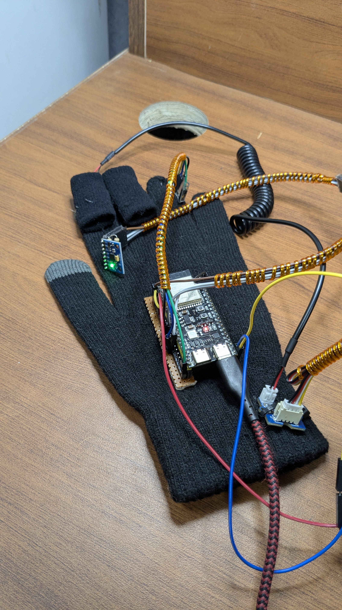
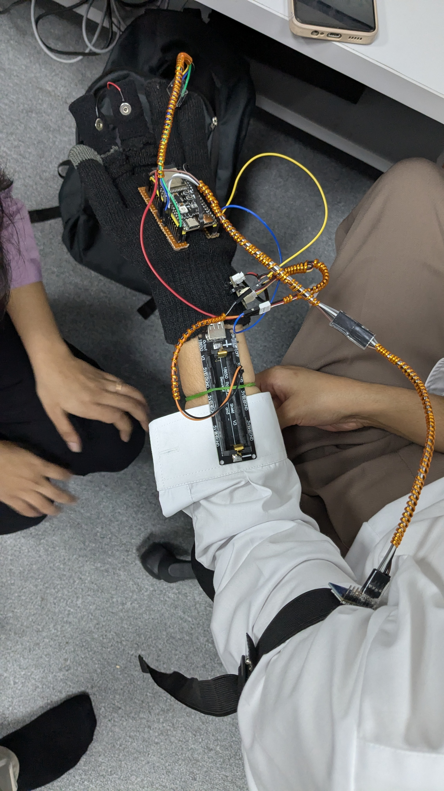
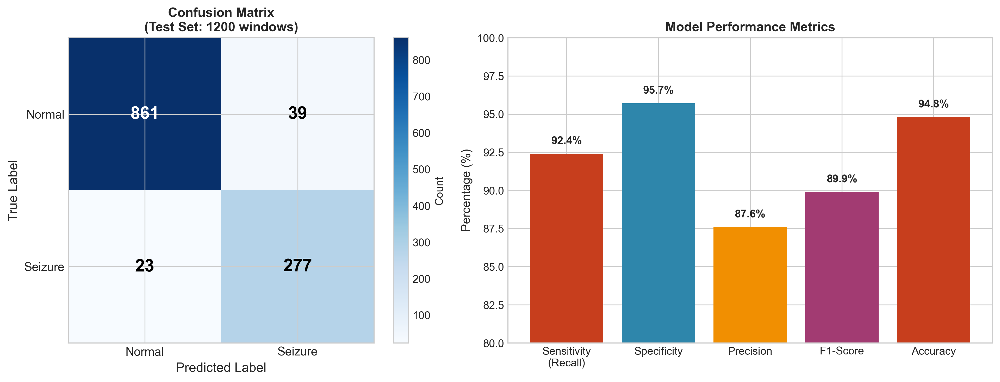
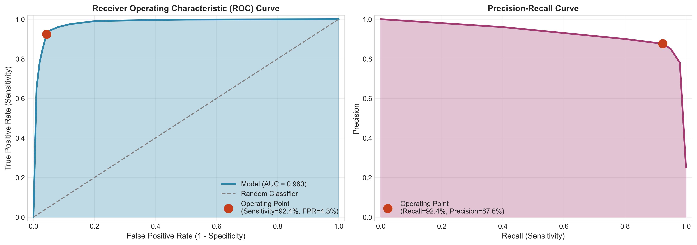

# SeizureSense  
### Edge-Based Seizure Detection Wearable using ESP32-S3 and Quantized TFLite Micro

SeizureSense is an embedded edge-AI system designed for real-time seizure detection using physiological and motion signals. The system runs a quantized TensorFlow Lite Micro model directly on the ESP32-S3 microcontroller for low-latency, offline inference.

This project demonstrates embedded systems design, signal processing, TinyML deployment, and real-time decision logic on resource-constrained hardware.

---

## 📸 Hardware Prototype

---

## 🎥 Live Edge Inference Demo

## 🚀 System Overview

The wearable device monitors:

- Galvanic Skin Response (GSR)
- Heart Rate Variability (HRV)
- Motion patterns (accelerometer)

A lightweight ML model classifies seizure events in real time without cloud dependency.

---

## 🧠 Embedded ML Deployment

- Model: Quantized INT8 TensorFlow Lite Micro
- Target: ESP32-S3
- Framework: ESP-IDF
- Language: C / C++
- Inference: On-device (Edge AI)

The model is optimized for:
- Low RAM footprint
- Low flash usage
- Real-time inference capability

---

## 📊 Model Performance

### Confusion Matrix

### ROC Curve

The model demonstrates strong classification capability for seizure detection scenarios.

---

## 📂 Repository Structure

.
├── README.md
├── firmware/
│ ├── CMakeLists.txt
│ ├── main/
│ │ ├── main.c
│ │ ├── gsr_detection.c
│ │ ├── hrv_detection.c
│ │ ├── seizure_filter.c
│ │ ├── detection_responder.cc
│ │ ├── model_settings.*
│ │ └── seizure_model_new.cc
│ ├── seizure_model_int8.tflite
│ └── report_graphs/

---

## 🛠 Build Environment

- ESP-IDF
- ESP32-S3 Toolchain
- CMake
- Python (for model conversion & evaluation only)

To build firmware:
idf.py build
idf.py flash
idf.py monitor

---

## ⚙️ Key Features

- Real-time physiological signal processing
- Adaptive thresholding logic
- Quantized TinyML inference
- Fully offline operation
- Resource-optimized firmware design

---

## 🎯 Project Highlights

- Edge AI deployment on microcontroller
- Embedded signal preprocessing pipeline
- Optimized memory allocation for TFLM
- Medical-safety oriented system logic
- Real-time event detection framework

---

## 📌 Future Improvements

- OTA firmware update support
- Model retraining with larger clinical datasets
- Low-power optimization for battery deployment
- GSM-based emergency alert integration

---

## 👨‍💻 Author

Molanguru Sonu Adithya  
Embedded Systems & Edge AI Engineer  
